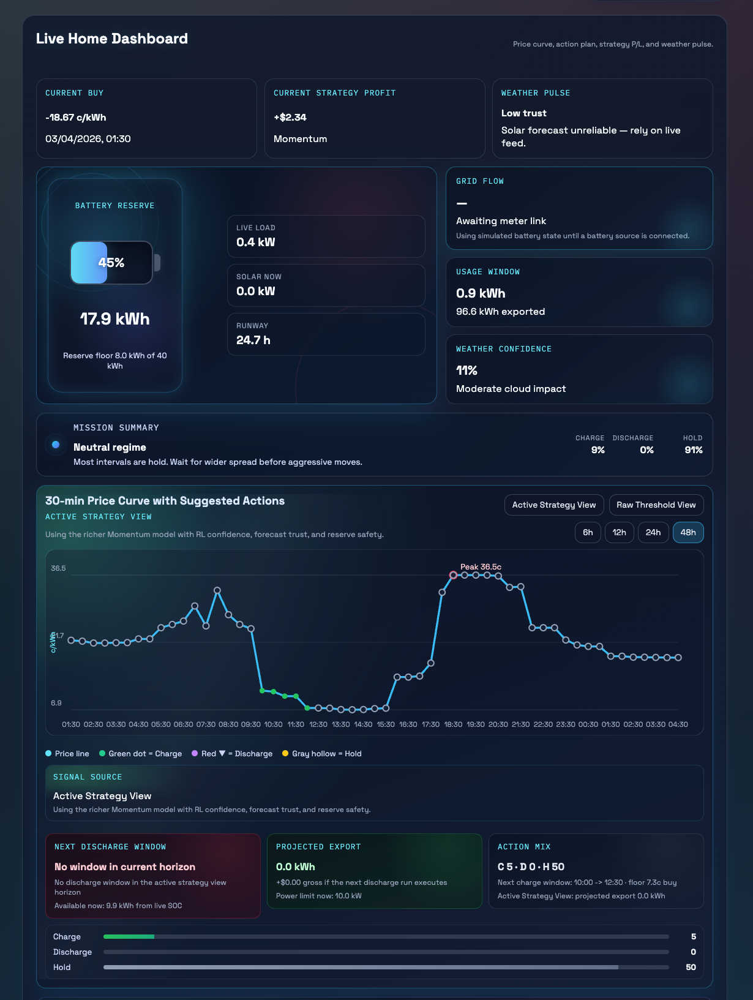
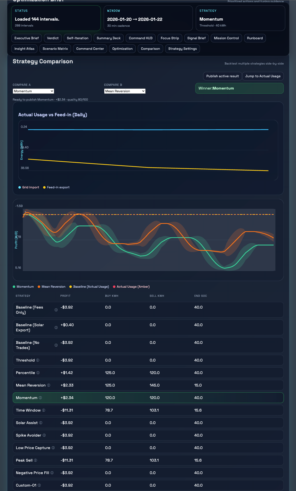
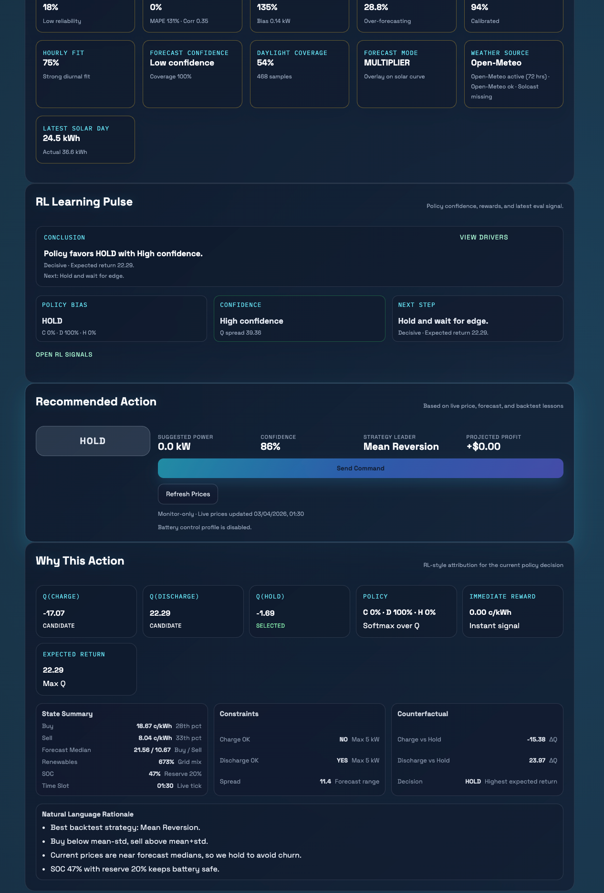
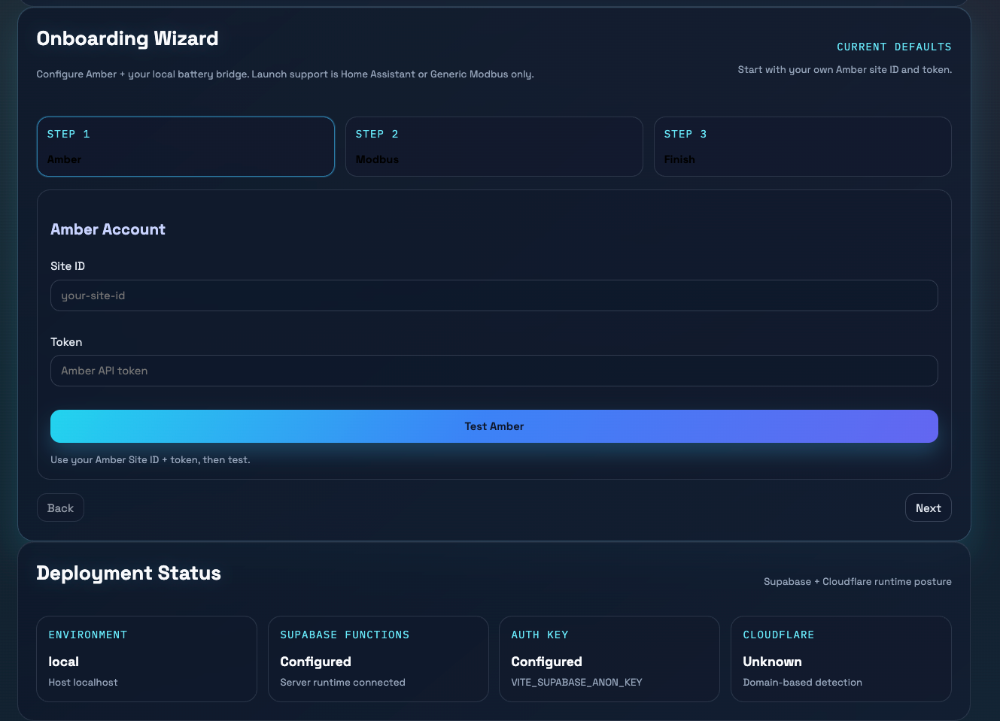
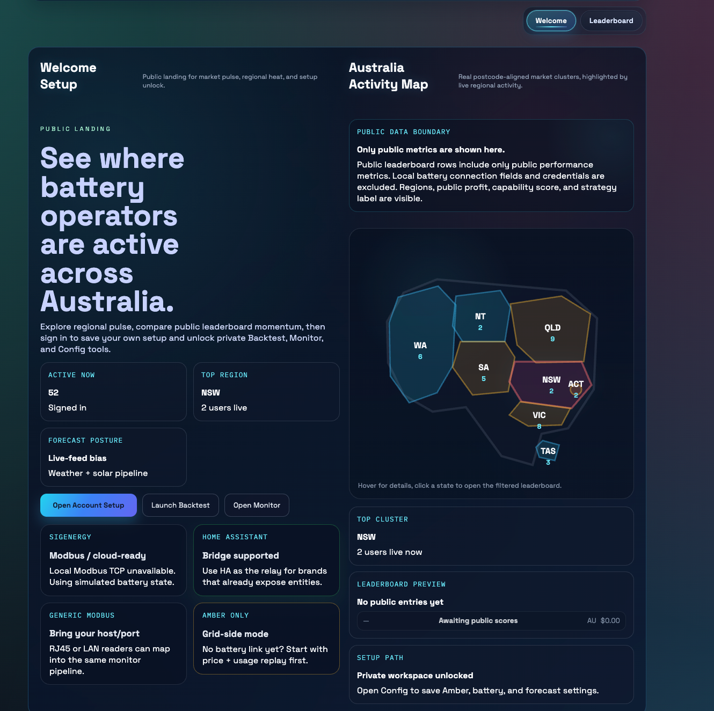
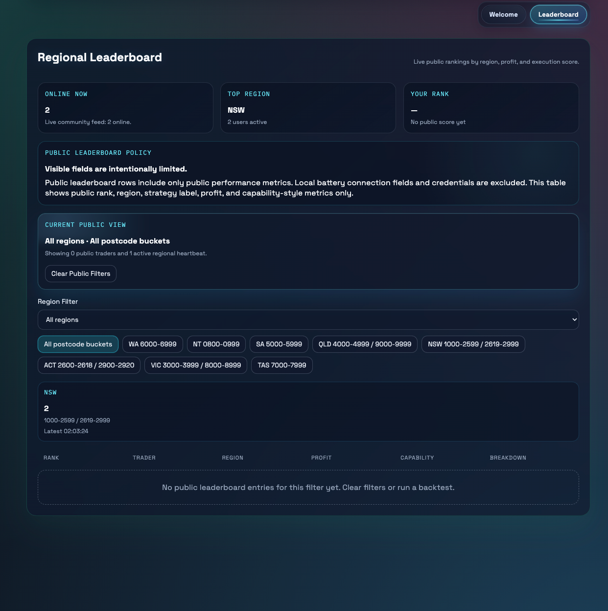
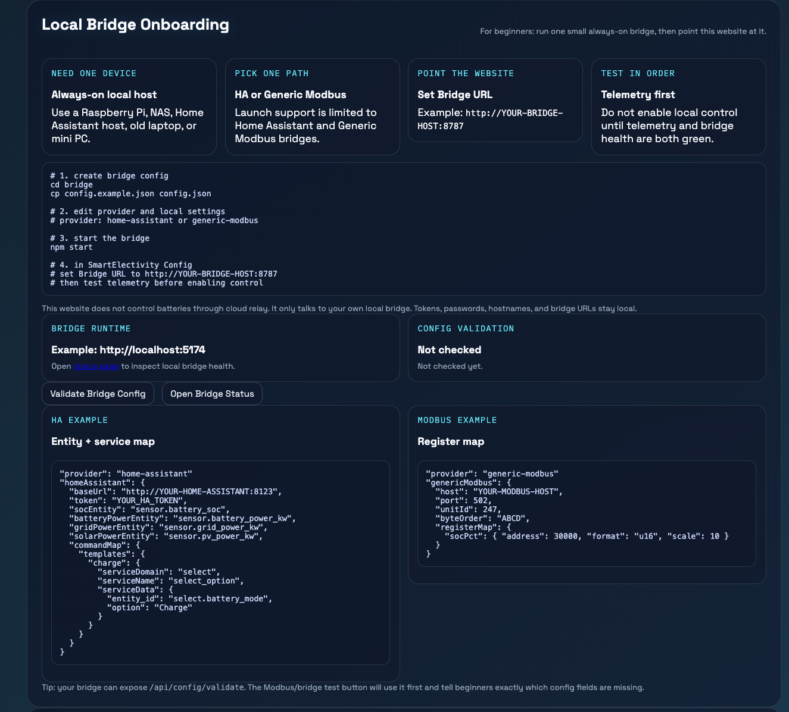

# SmartElectricity

**Optimize your home battery against real-time electricity prices.**  
**根据实时电价优化你的家庭电池。**

SmartElectricity is a local-first home battery optimization website for Amber users in Australia.  
It combines live price visibility, backtesting, battery monitoring, strategy tooling, and optional local control through your own Home Assistant or Generic Modbus bridge.

SmartElectricity 是一个面向澳洲 Amber 用户的本地优先家庭电池优化网站。  
它把实时电价、回测、电池监控、策略工具，以及通过你自己的 Home Assistant 或 Generic Modbus bridge 进行的本地控制整合到同一个界面中。

## What This Product Is / 这是什么产品

- A battery decision cockpit for Amber users
- A price-aware backtesting and strategy workspace
- A monitor-first dashboard for local battery telemetry
- An optional local-control surface that only works through your own local bridge

- 面向 Amber 用户的电池决策工作台
- 基于实时电价的回测与策略界面
- 以监控优先的本地电池遥测看板
- 仅通过你自己的本地 bridge 才能启用的可选控制界面

## What You Need / 你需要准备什么

### Minimum setup / 最低要求

- An Amber account
- Your own `Amber site ID`
- Your own `Amber API token`

- 一个 Amber 账号
- 你自己的 `Amber site ID`
- 你自己的 `Amber API token`

### Optional local battery setup / 可选的本地电池接入

If you want battery telemetry or local control, you also need one of these:

如果你想接电池监控或本地控制，还需要下面其中一种：

- `Home Assistant`
- `Generic Modbus`

You will usually need one always-on local device:

通常还需要一台常开本地设备：

- Raspberry Pi
- NAS
- Mini PC
- Old laptop
- Home Assistant host

## What The Website Supports / 网站支持什么

### 1. Amber workflow / Amber 工作流

- Pull Amber current and historical prices
- Backtest battery strategies
- Compare strategy outcomes
- Run LLM-assisted strategy overlays with your own API token

- 拉取 Amber 实时和历史电价
- 运行电池策略回测
- 对比不同策略结果
- 使用你自己的 API token 运行 LLM 策略叠加

### 2. Battery monitoring / 电池监控

- Local battery telemetry panels
- Source health and readiness status
- Monitor-first fallback when control is not available

- 本地电池遥测面板
- 数据源健康与就绪状态
- 在无法控制时优先提供监控模式

### 3. Local control / 本地控制

Launch scope supports local battery control only through:

上线版只支持通过以下方式进行本地电池控制：

- `Home Assistant`
- `Generic Modbus`

The website does **not** send battery commands through the cloud.

网站**不会**通过云端代发电池控制命令。

Commands stay on your own local network.

控制命令只会留在你自己的本地网络里。

## Supported Connection Paths / 支持的接入方式

### Home Assistant

Best for users who already run HA and already have their battery exposed as entities/services.

适合已经在用 HA，并且电池已经接入 HA 实体/服务的用户。

You will need:

你需要：

- Home Assistant URL
- Home Assistant token
- Required battery entities
- Optional service mappings if you want local control

- Home Assistant URL
- Home Assistant token
- 所需电池实体
- 如果要做本地控制，还需要配置 service 映射

### Generic Modbus

Best for advanced users or integrators who know the battery / inverter register map.

适合了解电池或逆变器寄存器映射的高级用户或集成商。

You will need:

你需要：

- Modbus host / port
- Unit ID
- Register map
- Optional write command mapping if you want local control

- Modbus host / port
- Unit ID
- Register map
- 如果要本地控制，还需要写寄存器映射

## What You Do Not Need / 你不需要什么

- You do **not** need the full source code to use the website
- You do **not** need to run the frontend locally if the hosted website is available
- You do **not** need to expose your battery directly to the public internet

- 你**不需要**完整源码也可以使用这个网站
- 如果网站已经托管好，你**不需要**本地跑前端
- 你**不需要**把电池直接暴露到公网

## How Users Actually Use It / 普通用户怎么使用

### Path A: Amber only / 只用 Amber

This is the simplest path.

这是最简单的使用方式。

1. Open the website
2. Sign up or sign in
3. Go to `Config`
4. Enter your `Amber site ID`
5. Enter your `Amber API token`
6. Save config and private secrets
7. Go to `Backtest` and start pulling data

1. 打开网站
2. 注册或登录
3. 进入 `Config`
4. 输入你的 `Amber site ID`
5. 输入你的 `Amber API token`
6. 保存配置和私有密钥
7. 去 `Backtest` 开始拉数据

### Path B: Amber + Home Assistant / Amber + Home Assistant

1. Prepare your own Home Assistant instance
2. Confirm battery entities are working in HA
3. Open `Config`
4. Enter your Amber setup
5. Point `Bridge URL` to your own HA bridge
6. Validate bridge config
7. Use `Monitor` for telemetry
8. Enable local control only after health checks are green

1. 准备你自己的 Home Assistant
2. 先确认电池实体在 HA 中能正常工作
3. 打开 `Config`
4. 填好 Amber 配置
5. 把 `Bridge URL` 指向你自己的 HA bridge
6. 校验 bridge 配置
7. 在 `Monitor` 里看遥测
8. 只有 health checks 全绿时再启用本地控制

### Path C: Amber + Generic Modbus / Amber + Generic Modbus

1. Prepare your Modbus-capable battery / inverter path
2. Confirm register mapping
3. Open `Config`
4. Enter your Amber setup
5. Point `Bridge URL` to your own Modbus bridge
6. Validate bridge config
7. Use `Monitor` for telemetry
8. Enable local control only after telemetry and command health are both ready

1. 准备好支持 Modbus 的电池或逆变器链路
2. 确认寄存器映射
3. 打开 `Config`
4. 填好 Amber 配置
5. 把 `Bridge URL` 指向你自己的 Modbus bridge
6. 校验 bridge 配置
7. 在 `Monitor` 看遥测
8. 只有 telemetry 和 command health 都 ready 时再启用本地控制

## Local Bridge Contract / 本地 Bridge 协议

Your local bridge should expose:

你的本地 bridge 需要提供：

```http
GET /api/health
GET /status
GET /api/config/validate
GET /api/battery/telemetry
GET /api/device/command/health
POST /api/device/command
```

This website talks to those endpoints.  
It does not need the full app source code to do that.

网站只需要调用这些接口。  
它不需要完整源码才能工作。

## Privacy And Security / 隐私与安全

### Stored as normal config / 普通配置保存

- Amber site ID
- non-secret strategy settings
- region / profile metadata

- Amber site ID
- 非敏感策略参数
- 区域 / profile 元数据

### Stored as private secrets / 私有密钥保存

- Amber API token
- Solcast API key
- LLM API token

- Amber API token
- Solcast API key
- LLM API token

### Never shown on public community pages / 永不出现在公共页面

- hostnames
- bridge URLs
- HA tokens
- Modbus register details
- passwords
- vendor credentials

- 主机地址
- bridge URL
- HA token
- Modbus 寄存器细节
- 密码
- 厂商凭据

## Screenshots / 截图建议

Place screenshots under `docs/screenshots/`.

请把截图放在 `docs/screenshots/` 目录下。

### Home


Capture:
- price curve
- action mix
- decision console

建议展示：
- 价格曲线
- 动作分布
- 决策面板

### Backtest


Capture:
- backtest controls
- strategy comparison
- result cards

建议展示：
- 回测控制区
- 策略对比
- 结果卡片

### Monitor


Capture:
- telemetry cards
- source health
- control readiness

建议展示：
- 遥测卡片
- 数据源健康状态
- 控制就绪状态

### Config


Capture:
- Amber setup
- private secret vault
- bridge validation

建议展示：
- Amber 配置
- 私有密钥仓
- bridge 校验

### Welcome


Capture:
- region map
- public summary
- top preview

建议展示：
- 区域地图
- 公共摘要
- 榜单预览

### Leaderboard


Capture:
- filters
- public policy block
- ranking table

建议展示：
- 筛选器
- 公共边界说明
- 排行榜表格

### Local Bridge


Capture:
- `/status`
- config validation
- command health

建议展示：
- `/status`
- 配置校验
- 控制健康状态

## Notes For Hosted Product Use / 托管网站使用说明

- If the hosted website is online, users can use it directly in the browser
- Local battery monitor/control still requires the user’s own Home Assistant or Generic Modbus path
- This product does not require public source code access for normal users

- 如果托管网站已经在线，用户可以直接在浏览器中使用
- 本地电池监控与控制仍然需要用户自己的 Home Assistant 或 Generic Modbus 链路
- 普通用户使用本产品不需要公开源码

## Related Documents / 相关文档

- Local bridge onboarding: [docs/local-bridge-onboarding.md](docs/local-bridge-onboarding.md)
- Local bridge contract: [docs/local-bridge-spec.md](docs/local-bridge-spec.md)
- Bridge runtime notes: [bridge/README.md](bridge/README.md)

## License / 许可

This product and repository are proprietary. Commercial use, redistribution, and modification are not allowed without prior written permission from Wang Zhen. See [LICENSE](LICENSE).

本产品和仓库采用专有许可。未经 Wang Zhen 书面许可，不得商用、再分发或修改。详见 [LICENSE](LICENSE)。
